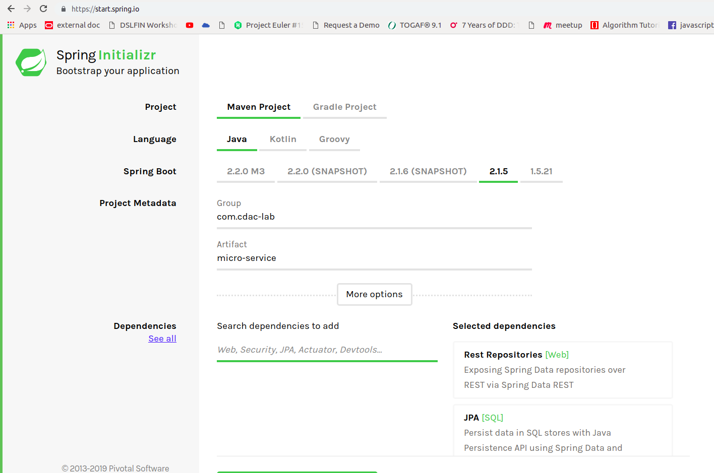

Open browser and open URL 
https://start.spring.io/

Make sure you have settings as mentioned below

	<groupId>org.springframework.samples.petclinic.client</groupId>
	<artifactId>spring-petclinic-customers-service</artifactId>
	<packaging>jar</packaging>
	<description>Spring PetClinic Customers Service</description>

# Lab Machine should hava

## Java 8+

1. Open Command Line
1. Check the out of 
    java -version
    
    java version "1.8.0_131"
    Java(TM) SE Runtime Environment (build 1.8.0_131-b11)
    Java HotSpot(TM) 64-Bit Server VM (build 25.131-b11, mixed mode)
    
## Spring Tool Suit (STS)
https://download.springsource.com/release/STS/3.9.8.RELEASE/dist/e4.11/spring-tool-suite-3.9.8.RELEASE-e4.11.0-win32-x86_64.zip

Unzip above file.

In folder where unzip happened, Start Application b
# On your machine

Check if zip is created and present in your download folder.
Unzip and add

# Application Requirements

# Use Cases

# Domain Model 

Look at Class diagram
 
#  Create Domain Model

1. Check class diagram

1. Make package model
 
  package org.springframework.samples.petclinic.customers.model;

1. Create Owner.java Class 

	class OwnerResource {}
	
1. Add below attributes

    private String firstName;
    private String lastName;
    private String address;
    private String city;
    private String telephone;
 
1. Annotate with JPA annotations

		@Entity
		@Table(name = "owners")
		public class Owner {
		    @Column(name = "first_name")
		    @NotEmpty
		    private String firstName;

		    @Column(name = "last_name")
		    @NotEmpty
		    private String lastName;

		    @Column(name = "address")
		    @NotEmpty
		    private String address;

		    @Column(name = "city")
		    @NotEmpty
		    private String city;

		    @Column(name = "telephone")
		    @NotEmpty
		    @Digits(fraction = 0, integer = 10)
		    private String telephone;
		}

1. Create Getters and Setters

1. Create ToString

1. Add identify column
		    @Id
    		    @GeneratedValue(strategy = GenerationType.IDENTITY)
    		    private Integer id;

Note: For now ignore Pets class

1. Change Port if jenkins too running
		

# In Memory Database

		<dependency>
		    <groupId>com.h2database</groupId>
		    <artifactId>h2</artifactId>
		    <scope>runtime</scope>
		</dependency>

# DAO model

create class OwnerRepository by extending

	import org.springframework.data.jpa.repository.JpaRepository;
	    public interface OwnerRepository extends    JpaRepository<Owner, Integer> { } 

# Create REST service

1. Make package web
1. Create Class

        class OwnerResource {}

1. Inject Repository
 
        class OwnerResource {
            OwnerRepository ownerRepository
        }

1. Now expose above class as REST endpoint

        @RequestMapping("/owners")
        @RestController
        class OwnerResource {
            OwnerRepository ownerRepository
        }

1. create Owner methods

	    @RequestMapping("/owners")
	    @RestController
		class OwnerResource {
		    OwnerRepository ownerRepository

		    @PostMapping
		    @ResponseStatus(HttpStatus.CREATED)
		    public Owner createOwner(@Valid @RequestBody Owner owner) {
			return ownerRepository.save(owner);
		    }

		}

1. Add find by id method as below

        @GetMapping(value = "/{ownerId}")
            public Optional<Owner> findOwner(@PathVariable("ownerId") int ownerId) {
                return ownerRepository.findById(ownerId);
            }

# Injecting Dummy Data for Start

We will use command line class to inject Temproary data
# Testing MicroService

Open  below in browser

http://localhost:8080/owners

http://localhost:8080/owners/1

http://localhost:8080/owners/2

